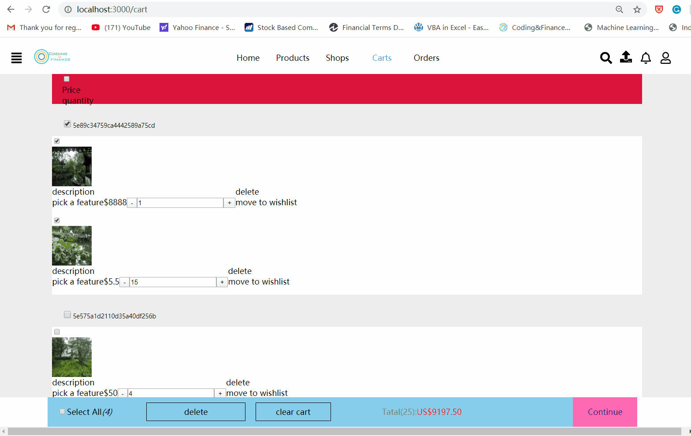
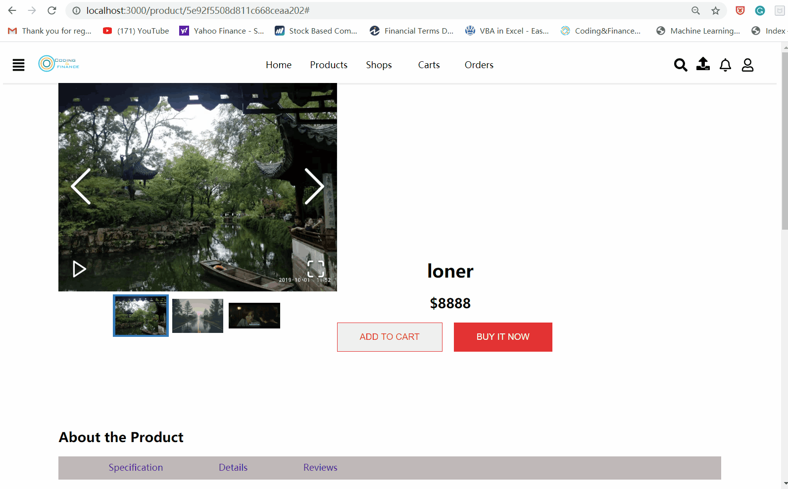

# mern-shop 
---
## Functionality achieved so far:
- sign up as customer
- login(inculde reset password through email)
- logout
- productUpload(not inculde upload video)
- backToTop. [^1]
- stickyToBottom [^2]
- stickyToTop. [^3]
- the CRUD of cartItem,selectAll/deleteAll and calculate the total number and price of checked cartItem
- display and search products and link each products to SingleProductPage
- display single product and recursive comment section of this product
- and so on

## Todos of year 2020:
* OrdersPage front-end and back-end
* video  upload for productUpload and video playing in SingleProductPage if has
* edit single product 
* styling CartPage
* styling SingleProductPage
* ...

;

[^3]: gif
    

[^3]: gif
    

[^3]: gif
    
